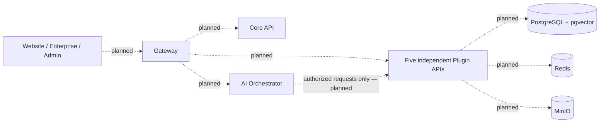

# Amani IA

Amani IA is a multi-tenant, plugin-based AI SaaS organized as an npm monorepo.
The repository contains three NestJS platform services, five independent NestJS
Plugin APIs and three Next.js frontends. Shared packages, workers and several
infrastructure components currently have reserved directories and documentation.

**Current status:** application scaffolds and local development foundations.
Business features, authentication, tenant enforcement, backend clients, persistence
and AI retrieval are not implemented. Use synthetic data only at this stage.
No ADRs existed at setup time; [decision status](docs/architecture/adr/README.md)
records pending work without inventing a decision history.

## Architecture

The intended request flow is frontend → Gateway → Core API / AI Orchestrator /
Plugin APIs. Plugins are independent backend services; the Orchestrator must obtain
data through APIs that enforce the requesting user's organization membership and
resource permissions. The current apps run independently; these calls are planned.



See [architecture and implementation status](docs/architecture/README.md),
[documentation index](docs/README.md) and [infrastructure](infrastructure/README.md).
Compose provisions local dependencies only; no application containers are added.

## Repository structure

| Directory | Contents and status |
| --- | --- |
| `apps/` | Gateway, Core API, AI Orchestrator, Admin, Enterprise, Website; initialized |
| `plugins/` | Knowledge, Data Analytics, Conversations, Connectors, Evaluation; initialized |
| `packages/` | `config`, `contracts`, `prompts`, `sdk`, `shared`, `types`, `ui`; documentation only |
| `workers/` | `data-engine`, `document-processing`; not initialized |
| `infrastructure/` | Local PostgreSQL, Redis, storage configuration; Docker, gateway, observability documentation |
| `docs/` | Architecture, diagrams, decision status, license decision and setup report |
| `scripts/` | Dependency-free structural inspection |
| `tests/` | Planned integration, contract and cross-service end-to-end test directories |

Each existing component has a README describing its actual status, responsibilities,
environment, commands, tests and service relationships.

## Prerequisites and workspaces

Use Node.js **22.17.0** (`.nvmrc`) and npm **10.9.x**, plus Docker Engine and Docker
Compose v2 or newer for local dependencies. The manifest accepts Node 22.17+ within
22.x and npm 10.9.2+ within 10.x. These are the setup baseline, not a claim that
other versions cannot work. Git, a POSIX shell, `find` and `curl` support the manual
workflow below. The existing Next.js layout fetches Google Geist fonts during
builds and therefore needs network access.

The root `package.json` is the workspace source of truth:

```json
"workspaces": ["apps/*", "plugins/*", "packages/*"]
```

Only directories with a `package.json` are npm packages. There are currently
**11 initialized workspaces** and **no initialized shared packages**. New shared
packages must use `@amani/<name>` and real check scripts. Workers are not npm
workspaces until their runtime and initialization are decided. The obsolete
`npm-workspace.yaml` has been removed. See the [npm workspace documentation](https://docs.npmjs.com/cli/v10/using-npm/workspaces/).

| Workspace | Path | Local port | Root development command |
| --- | --- | ---: | --- |
| `@amani/website` | `apps/website` | 3000 | `npm run dev:website` |
| `@amani/enterprise` | `apps/enterprise` | 3001 | `npm run dev:enterprise` |
| `@amani/admin` | `apps/admin` | 3002 | `npm run dev:admin` |
| `@amani/gateway` | `apps/gateway` | 4000 | `npm run dev:gateway` |
| `@amani/core-api` | `apps/core-api` | 4001 | `npm run dev:core` |
| `@amani/ai-orchestrator` | `apps/ai-orchestrator` | 4002 | `npm run dev:orchestrator` |
| `@amani/knowledge` | `plugins/knowledge` | 4101 | `npm run dev:knowledge` |
| `@amani/data-analytics` | `plugins/data-analytics` | 4102 | `npm run dev:data-analytics` |
| `@amani/conversations` | `plugins/conversations` | 4103 | `npm run dev:conversations` |
| `@amani/connectors` | `plugins/connectors` | 4104 | `npm run dev:connectors` |
| `@amani/evaluation` | `plugins/evaluation` | 4105 | `npm run dev:evaluation` |

## Installation — owner executes after review

No installation, child lockfile removal or dependency removal has been performed
as part of repository preparation. Review changes, then execute the following
**exact commands, in this order, from the repository root**:

```bash
# Supprimer les lockfiles des projets enfants
find apps plugins -name package-lock.json -delete

# Supprimer les dépendances locales
find apps plugins -name node_modules -type d -prune -exec rm -rf {} +

# Installer toutes les dépendances du monorepo
npm install
```

Your `npm install` generates the root `package-lock.json`; it has not been generated
or edited manually. Review and commit that root lockfile. Existing child lockfiles
are untouched and ignored pending your cleanup; package renaming intentionally
leaves them stale until then. Run installation only at the root. After a root
lockfile has been generated and reviewed, use `npm ci` for reproducible checkouts.
Dependency ranges and versions were preserved; a fresh resolution still needs
validation after your installation.

## Local development

Copy `.env.example` to `.env` if it does not already exist, then replace the local
credential placeholders. The root environment file configures Compose only.

```bash
cp -n .env.example .env
# Edit .env and choose local credentials before starting services.
npm run infra:config
npm run infra:up
npm run infra:status
```

`infra:config` validates the example without needing local secrets. To validate your
actual local values, run `docker compose config --quiet`. Infrastructure listens on
loopback: PostgreSQL `5432`, Redis `6379`, MinIO API `9000`, MinIO console `9001`.
Named volumes persist across `npm run infra:down`; that command does not erase data.
See the component READMEs for credentials, health probes and pgvector verification.
Containers have not been started during preparation.

Start the desired application in a separate terminal with a command from the
workspace table. `npm run dev` starts only Gateway; it does not launch the whole
system. No dependency services are required for the scaffold health routes.

Nest apps use their unique default port and `HOST=127.0.0.1`. To customize, copy that
workspace's `.env.example` to `.env` and edit it. Nest bootstraps load this file from
the workspace directory without overriding exported variables. Reserved downstream
URLs are commented out because no service clients consume them yet. Do not copy
root infrastructure credentials into browser variables.

Next.js ports and loopback hosts are explicit in each workspace's `dev` and `start`
scripts. Next.js cannot take its listening port from `.env`; override directly,
for example `npm run dev --workspace=@amani/admin -- --port 3202`. Optional frontend
environment values belong in that workspace's `.env.local`. See the
[Next CLI documentation](https://nextjs.org/docs/app/api-reference/cli/next).

## Health and security principles

All eight Nest services expose `GET /health`, returning HTTP 200 with
`{"status":"ok","service":"@amani/<name>"}`. This is process liveness only; it
makes no claim about database availability, Redis, storage, authorization or
readiness for business traffic. The original `GET /` greeting remains available.
The frontends have starter pages at `/` and no dedicated health route.

Before exposing business endpoints, every Plugin API must authenticate the caller,
verify the user's active membership in the selected organization, verify that the
plugin is enabled and enforce the action's permissions and resource scope. Neither
an organization header nor a trusted network is sufficient authorization. The AI
Orchestrator must retain user and organization context and retrieve only authorized
records, chunks and citations. Worker jobs, caches, object keys and vector searches
must preserve the same isolation. These are required boundaries, not implemented
security controls. See the architecture documentation for the complete model.

Never commit real customer data, local databases, credentials or generated files.
`.gitignore` covers common paths and keeps reviewed `.env.example` templates; it
cannot recognize sensitive data stored under arbitrary source filenames. Review
new files before staging. Use service-scoped credentials and authenticated backend
communication when implementing those clients; the current Compose credentials are
local development bootstrap credentials.

## Validation

Static checks that do not require dependency installation:

```bash
npm run check:structure
npm run infra:config
```

After the manual installation, validate the actual monorepo dependency resolution:

```bash
npm ls --workspaces --depth=0
npm run lint
npm run typecheck
npm run test:backend
npm run test:e2e
npm run build
npm test
```

Root lint is non-mutating (`lint:check`); original per-backend `lint` scripts still
apply fixes. Root lint/typecheck/build require scripts in every initialized
workspace and never use `--if-present`. Type checks generate Next route types first
and do not emit application builds. Backend unit and HTTP tests run across all
eight Nest services; they do not cover real storage or service-to-service requests.
**`npm test` intentionally fails while the three frontends have no test scripts.**
Do not interpret passing backend tests as complete monorepo coverage or add empty
success scripts to suppress this gap. Cross-service suites are also not implemented.

Once dependencies and services are running, inspect Compose status and check the
API liveness routes:

```bash
docker compose ps
for port in 4000 4001 4002 4101 4102 4103 4104 4105; do
  curl --fail --silent --show-error "http://127.0.0.1:$port/health" || exit 1
done
```

[SETUP-REPORT.md](docs/SETUP-REPORT.md) records checks actually completed against
existing local dependencies and checks still required after installation.

## Contribution and commit workflow

Read the relevant component README and architecture decision status before editing.
Follow frontend `AGENTS.md` files and the installed Next.js guides. Preserve service
boundaries, add real tests for behavior changes and document new variables or
ports. New architectural decisions should be recorded as new ADRs without rewriting
historical ones. Keep generated output and local configuration out of commits.

The root repository initially had no commits or remote. Eight empty generated
nested Git repositories have been backed up outside the project so all source is
part of this monorepo; the setup report records the reversible move. No staging,
commit or push has been performed. Because files are initially untracked,
`git diff` alone cannot display them; also inspect `git status --short` and file
contents.

After reviewing changes, completing manual installation and checking validation:

```bash
git status --short
git diff --check
git diff
# Review untracked files too, then stage only after your approval:
git add .
git diff --cached --check
git diff --cached --stat
git diff --cached
# Confirm ignored local data is absent and the generated root lockfile is included.
git commit -m "chore: prepare Amani IA monorepo foundations and documentation"
```

## License

No repository license or rights holder has been selected. Existing NestJS
`UNLICENSED` metadata is preserved and all npm packages are private. No copyright
owner has been invented. The owner must approve the policy and attribution
recorded in [LICENSE-DECISION.md](docs/LICENSE-DECISION.md) before any license text
is added.
