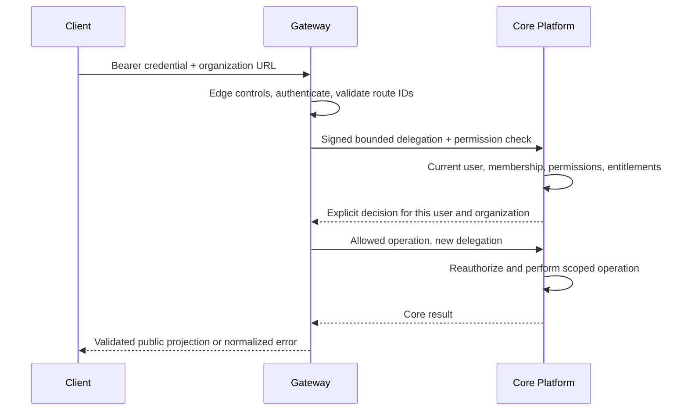

# API Gateway — Phase 4

`@amani/gateway` is the NestJS 11 external API boundary. It authenticates callers,
validates requests, builds context, asks Core for authorization and exposes explicit
Core Platform routes. It owns no business tables, role resolution, memberships,
entitlement logic or plugin resource ACLs. No Redis or PostgreSQL client is needed.

**Default behavior is closed:** protected routes return 401 until a user-authentication
provider is configured. Missing service authentication returns 503 before making a
business call. Production IAM and service authentication remain unselected under
proposed ADR-0011. The only enabled alternative is an explicitly configured **local
development** adapter. This phase does not provide production login or production
service credentials. See [the phase report](PHASE-4-REPORT.md) for executed validation.

## Structure and flow

```text
src/
  auth/             user authentication port, guards, route-policy metadata
  common/           request context, sanitized errors/logs, HTTP controls, limiter
  config/           @amani/config readers and local environment loading
  core-client/      native fetch, response projections, service-authentication port
  routing/          explicit Core Platform routes and request DTOs
  app.controller.ts liveness and dependency readiness
  app.module.ts     dependency injection and global guards
  main.ts           startup and shutdown
```



No role names are interpreted in Gateway. Core checks policy again at the business
operation, so the preliminary permission check does not replace downstream enforcement.
There is no authorization cache. A platform administrator receives no implicit tenant
membership. `/me` and organization creation deliberately use Core's self/onboarding
policy; all organization routes require explicit permission metadata. New protected
routes without policy metadata are denied.

## Routes

| Public route | Semantics |
| --- | --- |
| `GET /` | Preserved starter response |
| `GET /health` | Gateway process liveness only, no Core/database dependency |
| `GET /ready` | Both auth providers configured AND bounded Core `/health/ready` probe; 503 otherwise |

Readiness checks Core connectivity and Core's database readiness. It does not validate
the shared secret against a business call, provision a user, or prove production readiness.

| Protected route | Core destination | Gateway permission precheck |
| --- | --- | --- |
| `GET /api/platform/me` | `GET /users/<verified-user>` | Core self policy |
| `POST /api/platform/organizations` | `POST /organizations` | Core onboarding policy |
| `GET /api/platform/organizations/:organizationId` | `GET /organizations/:organizationId` | `organization.read` |
| `POST /api/platform/organizations/:organizationId/memberships` | Corresponding Core memberships route | `members.manage` |
| `GET /api/platform/organizations/:organizationId/memberships/:userId` | Core `memberships/by-user/:id` | `members.read` |
| `GET /api/platform/organizations/:organizationId/permissions` | Internal effective-permissions endpoint | `organization.read` |
| `GET /api/platform/organizations/:organizationId/plugins/:pluginKey/access` | Internal plugin-access endpoint | `organization.read`, then explicit Core `plugins.use` allow |

Organization creation accepts only `{name, slug}`; membership creation only `{userId}`,
where that ID is the target member, never the caller. IDs must be UUIDs and are normalized
to lowercase. Plugin keys are the five declared plugin names. Unknown JSON properties,
invalid shapes and invalid route IDs return 400. No arbitrary path/query/header proxy
exists. Global user creation, platform administration and all other internal Core
routes are unexposed. `/api/ai`, `/api/knowledge`, `/api/analytics`, `/api/conversations`
and other future families return 404; no Plugin API is contacted.

## Identity, context and header policy

`AuthenticationProvider` verifies the external credential and creates the shared
`AuthenticatedPrincipal` (user ID, authentication method, issue time; optional subject).
Organization selection is separate and comes exclusively from `:organizationId`.
A UUID identifies a tenant; Core membership and permission checks authorize access.

Gateway creates a fresh request ID for every request, even if the client supplies one,
to keep edge request identity unambiguous. A valid bounded correlation ID is retained;
otherwise `@amani/shared` generates one. Response headers and `ErrorEnvelope.meta`
carry these IDs. Neither ID grants authority.

The reserved header list is in `common/http.ts`: `x-user-id`, `x-organization-id`,
`x-roles`, `x-permissions`, `x-internal-service`, `x-service-name`, `x-calling-service`,
`x-actor-id`, `x-authenticated-user`, both `x-amani-development-*` proof headers,
`forwarded`, `x-forwarded-for`, `x-forwarded-host`, `x-forwarded-proto`. They are removed
from incoming headers before authentication/routing. Core requests are constructed
from an allowlist: `accept`, optional `content-type`, generated `x-request-id`, validated
`x-correlation-id`, and the service-auth provider's proof. Node adds transport headers
such as Host/Content-Length. Client Authorization, cookies and arbitrary headers are
never copied to Core. Proxy headers do not control the limiter's source address.

## Development authentication

Both adapters default to `disabled`. Enabling `development` requires explicit
`NODE_ENV=development` or `test`, a development/test `APP_ENV`, a loopback Gateway
listener and a loopback Core destination. Core independently enforces a loopback
listener and development/test environments. Production/staging rejects these modes
at startup. No environment flag enables unsigned user headers.

The development bearer is an opaque random secret mapped to ONE configured, existing
synthetic Core user. Core still rejects suspended users, inactive/nonexistent membership,
missing permissions and unavailable plugins. It is not a password, OIDC session or
production access token. Changing users requires changing this local server configuration;
a client cannot select an identity through a header or body.

The separate development service adapter uses HMAC-SHA256 over a base64url JSON
`DevelopmentDelegation`. Core verifies the signature before parsing claims. The signed
payload binds Gateway identity, Core audience, principal, optional organization,
operation/resource/plugin scope, request/correlation IDs, exact method/path/query and
SHA-256 of the raw JSON body. Its lifetime is at most 30 seconds. A UUID nonce is accepted
once; Core keeps at most 10,000 live nonces and denies at capacity. Keys must be distinct
32-byte random secrets encoded as 64 lowercase hexadecimal characters.

This protocol is for local integration only: one key pair of participants, process-local
replay memory, no credential rotation infrastructure, no asymmetric delegation or IAM.
The HTTP loopback restriction limits exposure; the signature establishes local service
trust. A compromised local service key can forge development delegation. Production
requires a separately accepted mechanism, credentials, transport/TLS and lifecycle.

## HTTP controls and resilience

- CORS uses exact configurable origins. Development defaults cover localhost/127.0.0.1
  on frontend ports 3000–3002. Credentials/cookies are not enabled. Allowed request
  headers are Authorization, Content-Type and the two tracing headers; methods GET/POST.
  Disallowed origins/preflight headers return 403. Requests without Origin still require
  authentication. Production defaults to no allowed origins and requires HTTPS origins.
- Headers include `nosniff`, frame denial, no-referrer, no-store and a restrictive API
  CSP. Production/staging adds HSTS. Express's version header is disabled. Trusted
  reverse-proxy configuration remains a deployment decision; forwarded IPs are ignored.
- JSON bodies default to 64 KiB. Malformed JSON gives 400, excess bytes 413, unsupported
  content types/compression 415. Compressed input is not inflated. Validation uses
  whitelist/forbidNonWhitelisted and no implicit primitive conversion. Large Knowledge
  uploads need their own future size, storage and permission design.
- Fixed-window quotas default to 120 requests/IP/minute, 120/authenticated user/minute,
  and 600/authorized organization/minute. `Retry-After` is returned on local 429.
  IP checks run before parsing; user checks require verified identity; organization
  checks run only after Core allows access. Counters are bounded to 10,000 live keys;
  exhaustion denies new keys. The limiter accepts an endpoint-class dimension for
  future policies; current routes share `all`. State is process-local and resets on
  restart. Redis/global replicas, ingress limits and production quotas remain future work.
- One native Node fetch client centralizes all Core calls. The default 3-second deadline
  covers headers AND response-body reading. Responses are limited to 256 KiB and must
  have a valid JSON contract. Redirects are refused. Authorization decisions must match
  user, organization, permission and allow/reason consistency. Other results are projected
  to known public fields; added Core fields are not accidentally exposed.
- There are no automatic retries, including organization/membership POSTs. A timed-out
  write may have committed in Core; reconcile its outcome before manually repeating it.

| Situation | External status |
| --- | --- |
| Invalid request / absent or invalid user credential | 400 / 401 |
| Core deny / missing object / conflict | 403 / 404 / 409 |
| Local quota or Core rate limit | 429 |
| Core 500, unexpected status, invalid JSON/shape, redirect, oversized result | 502 |
| Missing service-auth configuration or Core connection failure | 503 |
| Core deadline exceeded | 504 |
| Unexpected Gateway failure | 500 |

Core 400/403/404/409/429/503/504 retain their status. External errors use the shared
`{error:{code,message},meta}` envelope with fixed public text. No backend messages,
SQL, stacks, URLs, cookies or authentication challenges are exposed.

Logs are JSON with service/environment, request/correlation IDs, bounded HTTP method,
registered route template, status and duration. Backend logs add a fixed operation name
and transport outcome. Unmatched routes use `UNMATCHED`, never the incoming URL.
Bodies, tokens, cookies, query strings, raw exception text, backend URLs, user/tenant IDs
and service proof headers are omitted. A correlation ID is caller-supplied tracing data:
clients must not place secrets in it. No external log collector or retention policy is
introduced by this phase.

## Environment and local commands

Run commands from the repository root with Node 22.17+ / npm 10.9.x. The owner runs
`npm install` there after reviewing manifests; no dependency cleanup is necessary.
All new dependencies are already used by the existing Nest/Core stack: four shared
packages, class-validator, class-transformer and direct Express (no additional HTTP
client, database, Redis or security-middleware package).

```bash
npm install
# Create the file only if absent; preserve an existing local configuration.
test -f apps/gateway/.env || cp apps/gateway/.env.example apps/gateway/.env
chmod 600 apps/gateway/.env
npm run dev:gateway
# In another terminal:
curl --fail http://127.0.0.1:4000/health
# Expected 401 while authentication is disabled:
curl -i http://127.0.0.1:4000/api/platform/me
```

Each workspace loads only its own `.env` via Node's environment parser; existing shell
variables win. The root infrastructure `.env` is not loaded by Gateway. Shared packages
are built by Gateway's build/dev hooks. `start:prod` means run compiled JS; it does not
set `NODE_ENV=production` for you.

| Variable | Default / constraint |
| --- | --- |
| `GATEWAY_HOST`, `GATEWAY_PORT` | `127.0.0.1`, `4000`; old `HOST`/`PORT` fallback accepted |
| `NODE_ENV`, `APP_ENV` | development if absent; explicit NODE_ENV required for dev credentials |
| `CORE_API_BASE_URL` | `http://127.0.0.1:4001`; origin only, no credentials/query/path; HTTPS in production |
| `CORE_API_TIMEOUT_MS` | 3000; 10–30000 |
| `CORE_API_MAX_RESPONSE_BYTES` | 262144; 256–1048576 |
| `GATEWAY_ALLOWED_ORIGINS` | comma-separated exact origins; empty disables browser origins |
| `GATEWAY_BODY_LIMIT_BYTES` | 65536; 256–1048576 |
| `GATEWAY_RATE_WINDOW_MS` | 60000; 100–3600000 |
| `GATEWAY_RATE_IP`, `GATEWAY_RATE_USER`, `GATEWAY_RATE_ORGANIZATION` | 120 / 120 / 600; each 1–100000 |
| `GATEWAY_RATE_MAX_KEYS` | 10000; 1–100000 |
| `GATEWAY_AUTH_MODE`, `GATEWAY_SERVICE_AUTH_MODE` | `disabled` or local-only `development` |
| `GATEWAY_DEV_BEARER_TOKEN` | required only for dev user auth, random 64 lowercase hex |
| `GATEWAY_DEV_USER_ID` | existing synthetic Core user UUID; checked by Core at request time |
| `DEVELOPMENT_SERVICE_SECRET` | separate random 64-hex secret, identical in Gateway and Core |

For manual authenticated development, generate two separate values with this command,
once per secret, and put them only in the local `.env` files (never in commits or chat):

```bash
node -e 'process.stdout.write(require("node:crypto").randomBytes(32).toString("hex") + "\n")'
```

Set both Gateway modes to `development`, fill the bearer and synthetic user's ID,
and copy the DIFFERENT service secret into Core's `.env`. In Core also set
`NODE_ENV=development` and `CORE_SERVICE_AUTH_MODE=development`, retaining its current
PostgreSQL settings. Start Core with `npm run dev:core` and Gateway in a second terminal.
The Core development seed intentionally creates no users or platform administrator.
There is no public bootstrap/admin/login route: manual user provisioning remains a
separate controlled task. To exercise successful calls now without permanent identities,
use the integration suite below; it provisions only transactional synthetic fixtures.

## Tests and builds

```bash
npm run build --workspace=@amani/types --workspace=@amani/contracts --workspace=@amani/config --workspace=@amani/shared
npm run lint:check --workspace=@amani/gateway
npm run typecheck --workspace=@amani/gateway
npm test --workspace=@amani/gateway -- --runInBand
npm run test:e2e --workspace=@amani/gateway -- --runInBand
npm run build --workspace=@amani/gateway
# Compiled process, separate terminal; uses the current workspace environment:
npm run start:prod --workspace=@amani/gateway
```

Unit tests cover configuration, production exclusion, credential matching, readiness
and bounded limiter behavior. E2E boots the real Gateway and a local HTTP Core simulator;
it tests transport errors, slow headers/body, response validation, spoofing, input/HTTP
controls and sanitized logs. It does not pretend simulated Core policy is a database test.

For actual Core + PostgreSQL tests, the owner starts existing infrastructure first:

```bash
npm run infra:up -- --no-build --pull never
npm run infra:status
# Run only if Core's local env has not already been configured:
npm run env:local --workspace=@amani/core-api
GATEWAY_CORE_TESTS=true npm run test:integration --workspace=@amani/gateway
# Core regressions after its optional development-verifier integration:
npm run lint:check --workspace=@amani/core-api
npm run typecheck --workspace=@amani/core-api
npm test --workspace=@amani/core-api -- --runInBand
npm run test:e2e --workspace=@amani/core-api -- --runInBand
CORE_DB_TESTS=true npm run test:integration --workspace=@amani/core-api
npm run build --workspace=@amani/core-api
```

Gateway tests launch a **Core-owned** fixture process (`apps/core-api/test/gateway-fixture.ts`).
Gateway imports no Core source/ORM/schema. It receives only a loopback URL and synthetic
IDs via IPC, then uses HTTP contracts. Core holds migrations, seed, synthetic users,
organizations, roles and plugin state in an outer real PostgreSQL transaction; business
transactions use savepoints. Teardown rolls everything back, including API writes.
Authentication, signing, Core signature verification and policy services remain real.
No user token/key is written to disk or emitted by the fixture. Missing explicit opt-in,
credentials or PostgreSQL fail the suite instead of silently skipping.

Run integration suites serially: their transaction holds the Core migration advisory
lock. The fixtures are synthetic, but use a dedicated development instance if unrelated
work is active. No running Core process is required for this suite. Existing container
volumes and persistent business data are not reset.

## Remaining architecture decisions

All 30 ADRs were audited. Accepted service/tenant/Core ownership boundaries are preserved.
ADR-0011 remains proposed; illustrative NextAuth diagrams do not select IAM. Production
user authentication, service credentials/delegation, TLS ingress, CORS deployment origins,
proxy trust, global quotas, OpenAPI/versioning, credential rotation/revocation and safe
initial identity/admin provisioning remain open. Drizzle is the existing Core implementation
choice from phase 3, not a new shared ORM decision. Production readiness is not claimed.

Knowledge resource ACLs, upload/retention design, authenticated plugin integration and
negative cross-tenant resource tests belong to the next explicitly requested phase.
No Orchestrator, Plugin API, worker, frontend business feature or infrastructure redesign
is included here.
