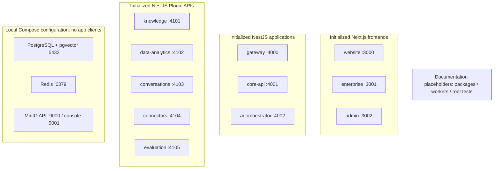
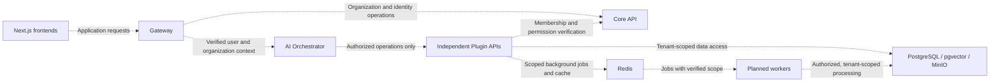
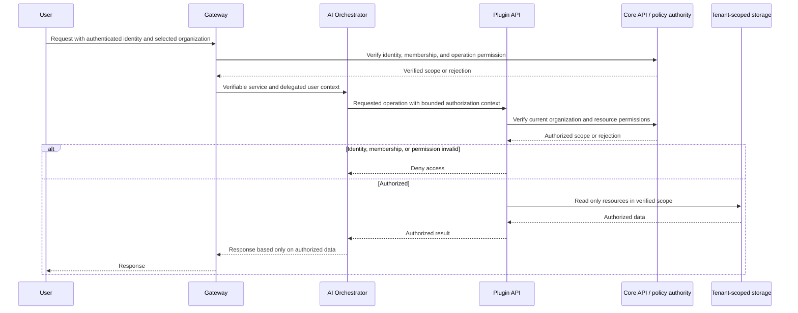

# Architecture diagrams

These diagrams distinguish the scaffolds currently present from intended service communication. Mermaid renders in compatible Markdown viewers.

## Current repository

The nodes below represent initialized code or prepared configuration. There are deliberately no runtime communication edges: service clients and business integrations have not been implemented.

## Intended backend architecture

Every dashed edge is planned, not a working integration. Frontends must not receive privileged backend credentials. Each Plugin API is an independent authorization boundary.

Storage ownership, transport credentials, permission lookup protocols, and job processing are not yet implemented. The diagram groups the five Plugin APIs for readability; it does not combine them into a single service.

## Required authorization flow

This sequence is a requirement for future business requests. None of the policy checks shown are implemented by the current health or starter routes.

The policy authority interaction is conceptual: no endpoint or token protocol has been selected. All denial paths must stop data access, including failures at the gateway or orchestrator.
