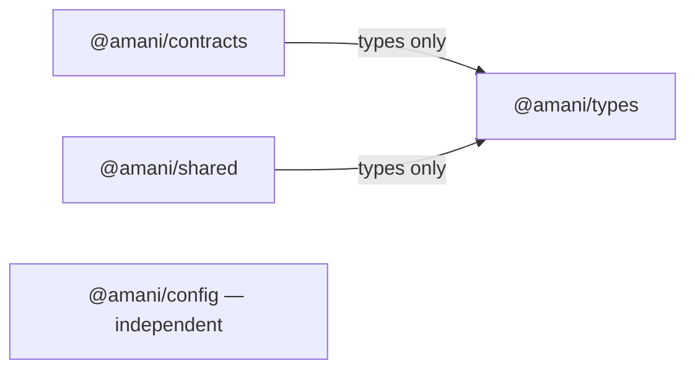

# Shared packages — Phase 1

Four private npm workspaces are initialized. They provide neutral types, transport
contracts, server environment validation and tracing helpers. No app, plugin,
worker or infrastructure component has been changed or integrated with them.
SDK, prompts and UI remain documentation-only placeholders.

| Package | Implemented | Dependencies, excluding development tools |
| --- | --- | --- |
| [@amani/types](types/README.md) | Branded IDs, names, JSON metadata, pagination | None |
| [@amani/contracts](contracts/README.md) | Contexts, API errors/metadata, liveness, events/jobs | `@amani/types`, type imports |
| [@amani/config](config/README.md) | Explicit server environment readers and safe errors | Node built-ins only |
| [@amani/shared](shared/README.md) | Request/correlation ID helpers | `@amani/types`, type imports; Node crypto |
| [sdk](sdk/README.md) | Reserved for a later phase | Not initialized |
| [prompts](prompts/README.md) | Reserved for a later phase | Not initialized |
| [ui](ui/README.md) | Reserved for a later phase | Not initialized |



## Audit and architectural boundaries

The audit covered all 30 ADRs and their index, architecture/authorization docs,
root npm manifest, current TypeScript/ESLint settings, installed tools, root lockfile
and all seven placeholders. Root workspaces already include `packages/*`; no root
manifest change is needed. These four additions bring initialized workspaces from
11 to 15.

Packages cannot import apps, plugins or workers. Business logic and persistence
remain service-owned. There are no new external runtime dependencies, schema
libraries or build frameworks. Existing TypeScript/ESLint/Jest tools are declared
explicitly in package manifests, using versions present in the local installation.

No accepted ADR conflict was found. Proposed ADR-0005/0006/0007/0011 leave transports,
schemas and authentication open; these packages do not select or implement them.
Events use the brief's `eventId` rather than ADR-0007's proposed `messageId`. The
packages-only task takes precedence over ADR-0030's suggested broader phase order.
No ADR status was changed.

## Build and package-only validation

Use Node 22.17.0 and npm 10.9.x as in the repository. Packages export CommonJS and
TypeScript declarations through `dist/`; Node CommonJS and ESM consumers are
supported. Config blocks browser resolution and exposes runtime code to Node only.
Types/contracts contain compile-time APIs, not runtime implementations.

TypeScript project references build `types` before `contracts`/`shared` when needed.
Source path mappings allow checks with the existing compiler before npm creates
workspace links. Emitted declarations still refer to `@amani/types`; installed
consumer resolution must be checked after the owner's installation. `typecheck`
includes compiler fixtures and emits no application code. Generated artifacts stay
inside ignored `dist/` directories.

Run from the repository root:

```bash
npm run build --workspace=@amani/types --workspace=@amani/contracts --workspace=@amani/config --workspace=@amani/shared
npm run typecheck --workspace=@amani/types --workspace=@amani/contracts --workspace=@amani/config --workspace=@amani/shared
npm run lint:check --workspace=@amani/types --workspace=@amani/contracts --workspace=@amani/config --workspace=@amani/shared
npm run test:types --workspace=@amani/types --workspace=@amani/contracts
npm run test --workspace=@amani/config --workspace=@amani/shared -- --runInBand
npm run check:structure
```

Config/shared have real Jest suites against emitted code, built by `pretest`.
Shared also checks package boundaries/cycles. Types/contracts use positive/negative
compiler fixtures (`test:types`), without fake runtime test scripts. Root `npm test`
still fails for the frontends' missing suites and for these two type-only packages'
absent runtime `test` scripts. Use targeted commands above; no root scripts were
changed. These checks do not establish service integration or security behavior.

## Manual installation by the owner

No installation, lockfile edits, dependency removal, staging, commit or push was
performed. The root lockfile does not yet include these four workspaces. After
review, the owner should run:

```bash
npm install
npm ls --workspace=@amani/types --workspace=@amani/contracts --workspace=@amani/config --workspace=@amani/shared --depth=0
# Then run the package-only validation commands above.
git diff -- package-lock.json
git status --short
```

Review and commit the npm-generated lockfile manually. A clean `npm ci` validation
belongs after that update; reproducibility cannot be claimed from the existing
local installation.

## Remaining work and future consumers

No service currently imports these packages. Future phases may add explicit
consumers, per-service startup configuration, tracing propagation, runtime schemas,
OpenAPI, compatibility tests and language-neutral contracts for Python. Describing
a verified context does not authenticate one; queued metadata grants no durable
access. SDK clients, prompts, UI and application tooling migrations remain deferred.

The root README and architecture status tables still describe the earlier setup.
They were left unchanged to respect the packages-only scope; this document records
the current package status.
