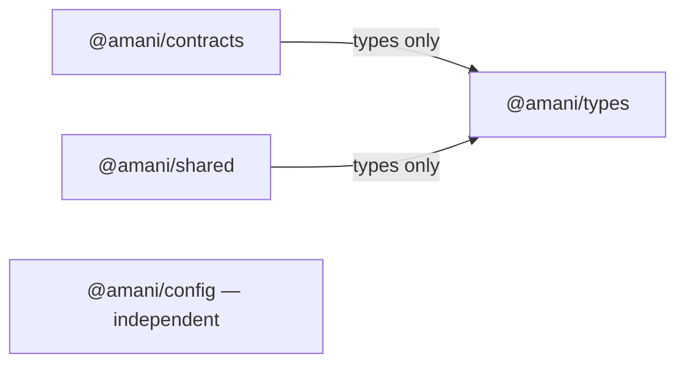

# Shared packages

Four private npm workspaces provide neutral types, transport contracts, server
environment validation and tracing helpers used by Core and Gateway.
SDK, prompts and UI remain documentation-only placeholders.

| Package | Implemented | Dependencies, excluding development tools |
| --- | --- | --- |
| [@amani/types](types/README.md) | Branded IDs, names, JSON metadata, pagination | None |
| [@amani/contracts](contracts/README.md) | Contexts, API errors/metadata, liveness, events/jobs | `@amani/types`, type imports |
| [@amani/config](config/README.md) | Explicit server environment readers and safe errors | Node built-ins only |
| [@amani/shared](shared/README.md) | Request/correlation ID helpers | `@amani/types`, type imports; Node crypto |
| [sdk](sdk/README.md) | Planned | Not initialized |
| [prompts](prompts/README.md) | Planned | Not initialized |
| [ui](ui/README.md) | Planned | Not initialized |



## Architectural boundaries

Packages cannot import apps, plugins or workers. Business logic and persistence
remain service-owned. There are no new external runtime dependencies, schema
libraries or build frameworks. Existing TypeScript/ESLint/Jest tools are declared
explicitly in package manifests, using versions present in the local installation.

Proposed ADR-0005/0006/0007/0011 leave transports, schemas and authentication open;
these packages do not select or implement them. Event envelopes use `eventId`.

## Build and package-only validation

Use Node 22.17.0 and npm 10.9.x as in the repository. Packages export CommonJS and
TypeScript declarations through `dist/`; Node CommonJS and ESM consumers are
supported. Config blocks browser resolution and exposes runtime code to Node only.
Types/contracts contain compile-time APIs, not runtime implementations.

TypeScript project references build `types` before `contracts`/`shared` when needed.
Source path mappings allow checks with the existing compiler before npm creates
workspace links. Emitted declarations refer to `@amani/types`, resolved through
the installed workspace links. `typecheck`
includes compiler fixtures and emits no application code. Generated artifacts stay
inside ignored `dist/` directories.

Run from the repository root:

```bash
npm run build --workspace=@amani/types --workspace=@amani/contracts --workspace=@amani/config --workspace=@amani/shared
npm run typecheck --workspace=@amani/types --workspace=@amani/contracts --workspace=@amani/config --workspace=@amani/shared
npm run lint:check --workspace=@amani/types --workspace=@amani/contracts --workspace=@amani/config --workspace=@amani/shared
npm run test:types --workspace=@amani/types --workspace=@amani/contracts
npm run test --workspace=@amani/config --workspace=@amani/shared -- --runInBand
npm run check:structure
```

Config/shared have real Jest suites against emitted code, built by `pretest`.
Shared also checks package boundaries/cycles. Types/contracts use positive/negative
compiler fixtures (`test:types`), without fake runtime test scripts. Root `npm test`
still fails for the frontends' missing suites and for these two type-only packages'
absent runtime `test` scripts. Use targeted commands above. Service integration
and security behavior are covered by the Core and Gateway suites.

## Manual installation by the owner

The root lockfile includes these workspaces. For initial setup or after changing
dependencies, the owner runs from the repository root:

```bash
npm install
npm ls --workspace=@amani/types --workspace=@amani/contracts --workspace=@amani/config --workspace=@amani/shared --depth=0
# Then run the package-only validation commands above.
git diff -- package-lock.json
git status --short
```

Review any npm-generated lockfile changes before committing them. Use `npm ci`
for a clean installation from the committed lockfile.

## Remaining work and future consumers

Core and Gateway consume these packages. Other services, plugins and workers can
adopt them as they are implemented. Runtime schemas, OpenAPI, compatibility tests
and language-neutral contracts for Python remain planned. Describing a verified
context does not authenticate one; queued metadata grants no durable access.
SDK clients, prompts, UI and application tooling migrations remain deferred.
